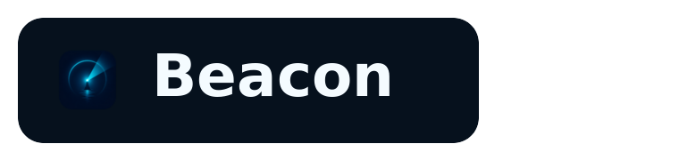
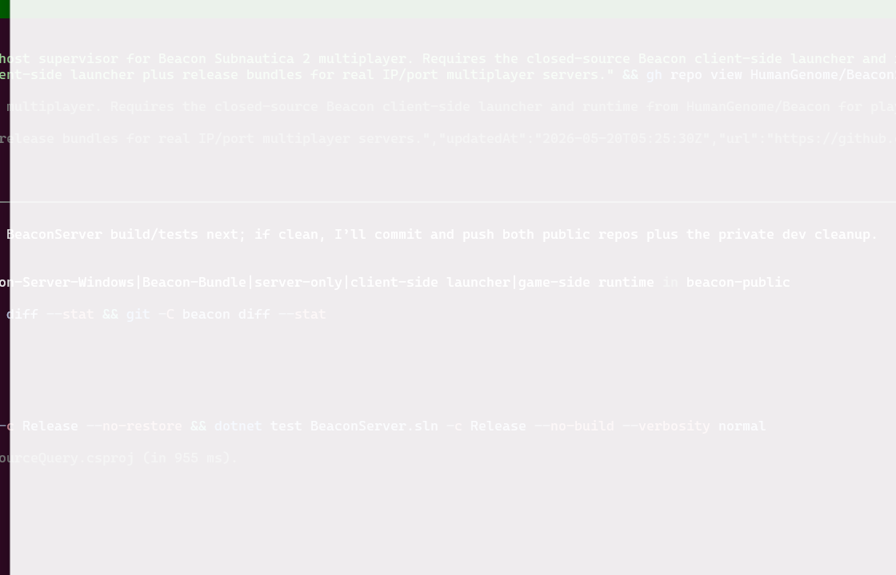

  

# Beacon

Real dedicated multiplayer for **Subnautica 2**. Your own IP-and-port server, friends join by address, your save lives on the server, run mods if you want. No friend-code lobby, no peer-to-peer, no four-player ceiling.

_Beacon is a community project and is not affiliated with or endorsed by the developers of Subnautica 2._

> **Official Hosting:** [SurvivalServers.com](https://www.survivalservers.com/games/subnautica_2/?utm_source=github&utm_medium=readme&utm_campaign=beacon) offers Subnautica 2 servers with Beacon pre-installed.

---

## Table of Contents

- [What Beacon is](#what-beacon-is)
- [Features](#features)
- [Install](#install)
- [Documentation](#documentation)
- [Source code](#source-code)
- [Releases](#releases)
- [License](#license)
- [Credits](#credits)

---

## What Beacon is

Beacon is two pieces that ship together:

- **Beacon Launcher** — desktop app every player installs. Adds servers by IP and port, launches Subnautica 2 into the right session, manages your character roster, and gives admins a snapshot / restore / RCON console panel. Distributed as a **closed-source binary**.
- **BeaconServer** — Windows supervisor that the host machine runs alongside Subnautica 2. Handles process supervision, save snapshots, Source A2S query, Source RCON, and an HMAC-signed HTTP admin API. **Open source under MIT** at [HumanGenome/BeaconServer](https://github.com/HumanGenome/BeaconServer).

You install the launcher to join. A managed host (or you) runs BeaconServer next to a Subnautica 2 install to host.

---

## Features

### Real Dedicated Server
Friends connect by IP and port. The server stays up when you log off, your world persists on the server's disk, no host migration when the "host" leaves.

### Beyond the 4-Player Cap
Stock Subnautica 2 caps coop at 4 players. Beacon replaces the transport layer with Unreal's standard listen-server networking, so you can run 6, 8, or more on the same world.

### Multi-Character Profiles
Each player keeps multiple characters on the same server. The launcher remembers which character you used where; the server keeps each character's save shard isolated.

### Save Snapshots & Rollback
Beacon snapshots your world automatically and on demand. Bad merge, raid wipe, deleted base? Roll back from the launcher's admin panel.

### Admin Console (RCON)
Standard Source RCON listener on `gameplay port + 3`. Use any standard RCON client.

### Server Browser Support
Beacon responds to Source A2S queries — server browsers, monitoring tools, and Discord status bots can see your server's name, map, player count, and uptime.

### Mods
Lua and C++ mods load via UE4SS on both server and client.

---

## Install

### Prerequisites

- **Windows 10 or 11** (64-bit)
- **Subnautica 2** installed (Steam, Epic Games, or Microsoft Store)
- A way to reach the server — managed hosting (e.g. SurvivalServers), or a Windows machine on your network with a port forwarded

### Step 1: Install the Launcher (every player)

1. Download `BeaconSetup-<version>.exe` from the [latest release](https://github.com/HumanGenome/Beacon/releases/latest).
2. Run the installer. Windows SmartScreen will flag it because the binary isn't code-signed — click **More info → Run anyway**.
3. The installer drops Beacon into `%LOCALAPPDATA%\Beacon\` and adds a Start Menu shortcut.

### Step 2: Set Up Your Server (self-host)

If you're using managed hosting, skip this step.

Download `Beacon-Bundle-Windows-x64-v<version>.zip` from the [latest release](https://github.com/HumanGenome/Beacon/releases/latest), extract, edit `BeaconServer\appsettings.json`, forward UDP `<port>` + `<port>+2` and TCP `<port>+3` + `<port>+4`, and run `BeaconServer\BeaconServer.exe`. Full self-host instructions are in the [BeaconServer README](https://github.com/HumanGenome/BeaconServer#installation).

The server-only zip contains the MIT BeaconServer binaries only. A playable Subnautica 2 host also needs the Beacon game-side runtime and UE4SS layout included in the bundle.

### Step 3: Connect

Open the launcher, click **Add server**, enter host address + gameplay port + optional admin password, click **Connect**. Subnautica 2 launches and drops you in.

---

## Documentation

- **[Admin & RCON guide](https://github.com/HumanGenome/BeaconServer/blob/main/docs/ADMIN.md)** — launcher admin panel, RCON command reference, HTTP admin API
- **[Modding guide](https://github.com/HumanGenome/BeaconServer/blob/main/docs/MODS.md)** — Lua and C++ mod entry points
- **[BeaconServer source](https://github.com/HumanGenome/BeaconServer)** — server code, MIT licensed

---

## Source code

| Component | Source | License |
|---|---|---|
| **BeaconServer** (host supervisor + API) | [HumanGenome/BeaconServer](https://github.com/HumanGenome/BeaconServer) | MIT |
| **Beacon Launcher** (desktop app + game-side plugin) | Closed source | Proprietary binary, free to use, see [LICENSE](LICENSE) |

The split is deliberate: the server (where any host runs Beacon) is fully open and forkable. The launcher (where the runtime UE5 instrumentation lives) is closed for now while the project stabilizes; that may change in future.

---

## Releases

All releases of both components are published here, on this repo's [Releases page](https://github.com/HumanGenome/Beacon/releases). Each release attaches:

- `BeaconSetup-<version>.exe` — Beacon Launcher installer
- `Beacon-Launcher-Windows-x64-v<version>.zip` — portable launcher bundle
- `Beacon-Bundle-Windows-x64-v<version>.zip` — complete self-host bundle
- `Beacon-Server-Windows-x64-v<version>.zip` — BeaconServer binaries only
- `checksums.txt` — release checksums

BeaconServer also publishes to its own [Releases page](https://github.com/HumanGenome/BeaconServer/releases) for self-hosters who only want the server.

---

## Contributing

Issues and pull requests for the **server** are welcome at [HumanGenome/BeaconServer](https://github.com/HumanGenome/BeaconServer). For the **launcher**, please file bug reports and feature requests on this repo's [Issues](https://github.com/HumanGenome/Beacon/issues) — but PRs against the launcher aren't accepted since the source isn't public.

---

## License

The contents of this repository (README, docs) are licensed under MIT (see [LICENSE](LICENSE)).

The Beacon Launcher binary attached to releases is **closed source**. It is free to download and use, but redistribution, modification, decompilation, and reverse-engineering of the launcher binary are not permitted. The launcher's installer EULA contains the full terms.

BeaconServer (the host-side supervisor) is separately licensed under MIT at [HumanGenome/BeaconServer](https://github.com/HumanGenome/BeaconServer).

---

## Credits

- [UE4SS](https://github.com/UE4SS-RE/RE-UE4SS) — Unreal Engine scripting and modding framework
- [Avalonia](https://avaloniaui.net/) — cross-platform .NET UI used by the launcher
