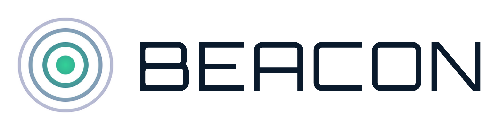

  <picture>
    <source media="(prefers-color-scheme: dark)" srcset="docs/img/beacon-lockup-dark.png">
    
  </picture>

# Beacon

Beacon gives **Subnautica 2** IP/port multiplayer: players join through the Beacon desktop app, hosts run a Beacon server package next to Subnautica 2, and worlds stay on the server with snapshots, rollback, admin tools, server query, and mod support. No friend-code lobby, no peer-to-peer handoff, no four-player ceiling.

Every player must install Beacon to join a Beacon server. Stock Subnautica 2 cannot connect to Beacon servers directly.

  

## Features

### 🧭 Join by IP and port
Add a server address once, pick your character, and connect straight into the hosted world.

### 👥 Larger groups
Beacon removes the stock four-player lobby limit. Larger groups are supported by the Beacon transport path, though Subnautica 2's pacing is still balanced around smaller crews.

### 💾 Server-side worlds
The world lives on the host machine. The server can keep running after a player leaves, and save snapshots give admins a recovery point before major changes.

### 🔁 Snapshots and rollback
Admins can take snapshots, list saved worlds, and restore a previous world from Beacon's world tools or RCON.

### 🧑‍🚀 Multiple characters
Players can keep separate characters per server. Beacon remembers the character you used for each saved server.

### 🛠 Admin console
BeaconServer exposes Source RCON on the server's RCON port for commands like `help`, `status`, `players`, `ping`, `save snapshot`, and `save list`.

### 📡 Server query
BeaconServer answers Source A2S query so server lists, monitoring tools, and bots can read status and player counts.

### 🧩 Mods
Beacon uses UE4SS for Lua and C++ mod loading on the client and host runtime.

## Install

### Managed hosting
The shortest path is [SurvivalServers.com Subnautica 2 hosting](https://www.survivalservers.com/services/game_servers/subnautica_2/?utm_source=github&utm_medium=readme_install&utm_campaign=beacon). Beacon is already installed, ports are handled, and the panel shows a one-click Beacon setup link for players.

### Players
1. Download `BeaconSetup-<version>.exe` from the [latest release](https://github.com/HumanGenome/Beacon/releases/latest).
2. Run the installer. Windows SmartScreen may warn because the installer is not code-signed yet; choose **More info** then **Run anyway**.
3. Open Beacon, add the server address, select or create a character, and click **Connect**.

Beacon also checks for launcher updates automatically on launch and while it is running.

### Self-hosted servers
1. Download `Beacon-Server-Windows-x64-v<version>.zip` from the [latest BeaconServer release](https://github.com/HumanGenome/BeaconServer/releases/latest).
2. Extract it on the Windows host.
3. Edit `BeaconServer\appsettings.json`.
4. Forward/open the gameplay UDP port, query UDP port, RCON TCP port, and admin HTTP TCP port.
5. Run `BeaconServer\BeaconServer.exe`.

Full server setup, settings, source query examples, RCON commands, and build instructions live in [HumanGenome/BeaconServer](https://github.com/HumanGenome/BeaconServer).

## Releases

This repo publishes the launcher only:

- `BeaconSetup-<version>.exe` — installer for players
- `BeaconSetup-latest.exe` — stable download URL that always points at the most recent installer
- `Beacon-Launcher-Windows-x64-v<version>.zip` — portable launcher build
- `checksums-launcher.txt` — hashes for the launcher assets

The dedicated server package (`Beacon-Server-Windows-x64-v<version>.zip`) lives on the [BeaconServer release page](https://github.com/HumanGenome/BeaconServer/releases/latest).

Source archives are generated by GitHub automatically for tags.

## Source

BeaconServer source is open at [HumanGenome/BeaconServer](https://github.com/HumanGenome/BeaconServer).

This repo is the public download and documentation hub for the Beacon client app and release assets.

## Community Note

Beacon is a community project and is not affiliated with or endorsed by the developers of Subnautica 2.

## License

See [LICENSE](LICENSE).

## Credits

- [UE4SS](https://github.com/UE4SS-RE/RE-UE4SS) — Unreal Engine scripting and modding framework
- [Avalonia](https://avaloniaui.net/) — .NET UI framework used by Beacon
